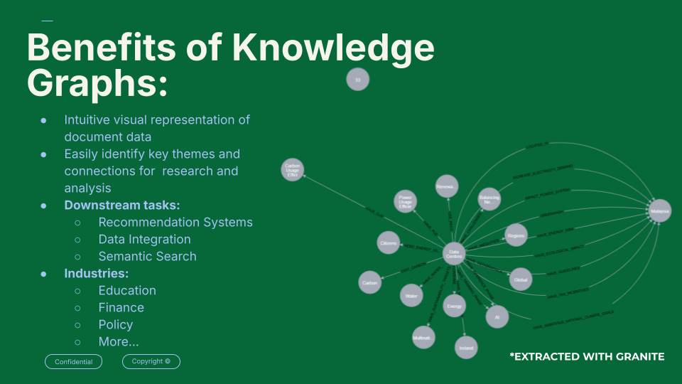

# Knowledge Graph Extraction with IBM Granite Instruct and Code Models

## Lablabai Generative AI Hackathon Project : Using IBM Granite Models to Generate Knowledge Graphs

This project leverages IBM's Granite Instruct and Granite Code models to extract key themes and relationships from documents, facilitating easier data organization and analysis. By utilizing Large Language Models (LLMs), the pipeline identifies significant concepts, themes, and their connections within unstructured text, transforming them into a structured knowledge graph.

The primary goal is to help users (reseachers, analysts, etc) to efficiently extract insights from large volumes of textual data and identify hidden patterns and relationships that are valuable for deeper investigation. The generated knowledge graph can be visualized and queried to support various downstream tasks, including: data integration, recsys and semantic search and more.

